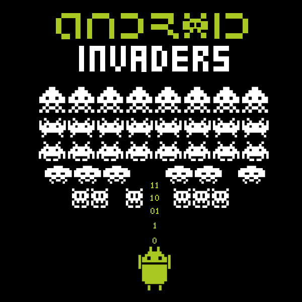

# Android Invaders

Charla sobre seguridad en dispositivos Android. Realizada para [#MiercolesGeek](https://github.com/iblancasa/miercolesgeek) gracias a la Oficina de Software Libre.

**Fecha**: 9 de Marzo de 2016

**Lugar**: ETSIIT - Universidad de Granada

**En construcción...**

## Autores

<a href="https://github.com/juanvelascogomez">@juanvelascogomez</a>, <a href="https://github.com/asolisi">@asolisi</a> y <a href="https://github.com/neon520">@neon520</a>

## Puntos de la charla

**1.** Introducción, algunos conceptos y explicación breve de las pruebas de concepto que se realizarán durante la charla.

**2.** Creación de un apk que permita la intrusión al sistema Android. Camuflando el apk creado con otra del market.

**3.** Prueba de concepto en red local. Intrusión en Android. ¿Cómo convertirse en root?

**4.** Cómo trasladar eso a otras redes. Ataques fuera de LAN.
